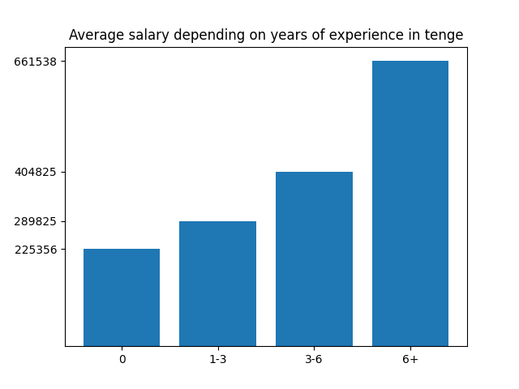
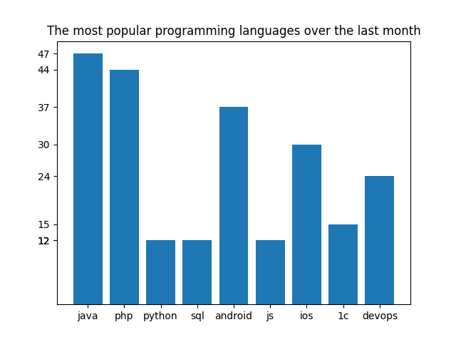
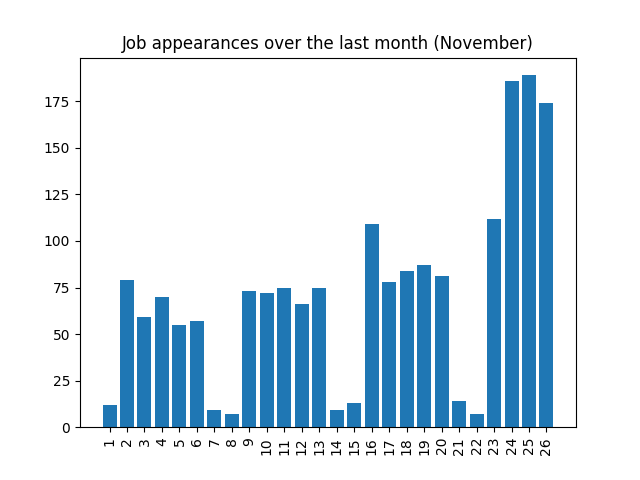

# Parsing vacancies
It's a python program that helps you to parse data from hh.kz

## Prerequisites

Your computer must have:
* Python (latest version)

## Installation

These instructions allow you to run a copy of the project on your local machine for development and testing purposes.

1. Download the entire repository.
2. Place the hh-parser directory in your Python environment.
3. Go to the hh-parser directory and do the following:
``
pip install -r requirements.txt
``

If this is the first time, select the suggested configuration.
At any time in the future, you can easily run the configuration to apply the changes.

## To run the file

For Windows - `python endpoint.py`

For Ubuntu / Linux - `python3 endpoint.py`

It will run on http://localhost:5000

## How it works?

Firstly you need to make an http get request to parse vacancies. It creates several csv files ('all_vacancies.csv', 'no_experience_vacancies.csv', 'experience_1_and_3_vacancies.csv', 'experience_3_and_6_vacancies.csv', 'experience_more_than_6_vacancies.csv')
 
``
curl localhost:5000/parse | json_pp
``
 
Then you can use these data
* to get all vacancies with title, salary, company, location, date
* to calculate average salary depending on years of experience
* to determine the most popular vacancies on the website
* to figure out the number of vacancies appearing on the website

For each of them except the first, there are exists endpoints that create .png files with graphs:
 
``
curl localhost:5000/vacancies | json_pp
``

``
curl localhost:5000/experience | json_pp
``
 

 

``
curl localhost:5000/trend | json_pp
``
 

 
``
curl localhost:5000/appearance | json_pp
``
 

 
